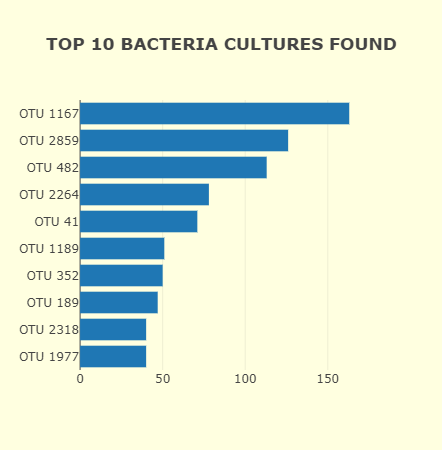
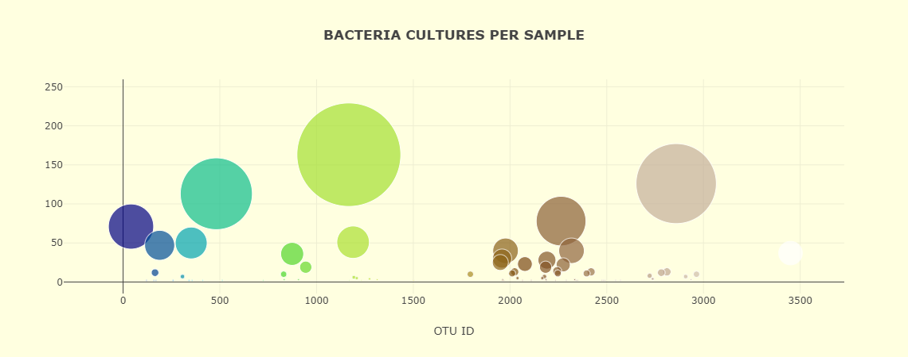
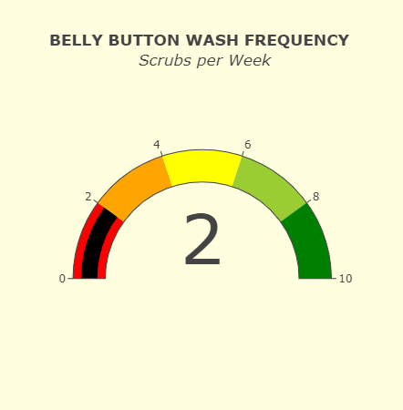
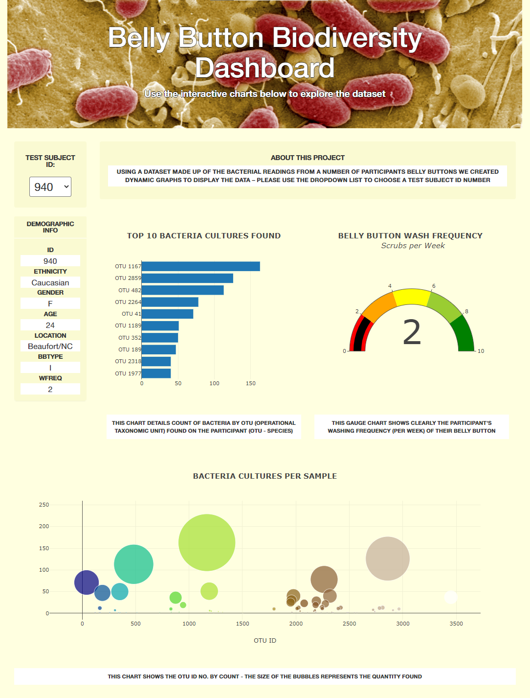

# Challenge - Improbable Beef

## Challenge - Overview

In this module we explored using the JavaScript libraries Plotly and D3 to create dynamic graphs. We were given a dataset that contained the bacteria counts from a number of anonymised participants and were tasked with displaying it on a webpage for easy access and use.

We read the data in using D3 and then used a dropdown menu on our page to choose each participant. We had a function run every time the choice in the drop down was changed, which redrew the graphs on the page. This meant our page was very interactive and the dynamic updates meant the user had no issuing navigating to their data.

## Challenge - Deliverable 1 - Horizontal Bar Chart

We use the OTU IDs (Operational Taxonomic Unit - Species/Bacteria Type) and the quantities found of each to populate a horizontal bar chart. We pull the top 10 highest OTU IDs for our y-values, and their corresponding counts for the x-values. Then we make sure they're revered, along with the hover data (OTU named details) so they make for a pleasing bar chart. We also include `{responsive: true}` as a config argument for Plotly so that the graph scales with browser size. Here's the JavaScript that created the bar chart:

```js
var yticks = otu_ids.slice(0,10).map((id) => "OTU " + id.toString()).reverse();

var barData = [{
  x: sample_values.slice(0,10).reverse(),
  y: yticks,
  type: "bar",
  orientation: "h",
  text: otu_labels.slice(0,10).reverse()
}];

var barLayout = {
  title: "<b>TOP 10 BACTERIA CULTURES FOUND</b>",
  plot_bgcolor: "lightyellow",
  paper_bgcolor: "lightyellow"
};

Plotly.newPlot("bar", barData, barLayout, {responsive: true});

```

And the bar chart:



## Challenge - Deliverable 2 - Bubble Chart

We use the same data as Deliverable 1 but this time we are plotting it as a bubble chart. This means essentially making a line (or even scatter) chart without the line, and having the markers change in size depending on a given variable. In this case we use the quantity of the found bacteria for both y-values and the sizes of the bubbles. We also included some formatting by using the `color` and `colorscale` arguments. ***For the size argument we mapped it to scale it smaller, this was done to match the challenge's result.***

```js
var bubbleData = [{
  x: otu_ids,
  y: sample_values,
  text: otu_labels,
  mode: "markers",
  marker: {
    // Scaled to match Challenge Picture.
    size: sample_values.map((v) => v * 0.8),
    color: otu_ids,
    colorscale:"Earth"
  }
}];

var bubbleLayout = {
  title: "<b>BACTERIA CULTURES PER SAMPLE</b>",
  xaxis: {title: "OTU ID"},
  hovermode: "closest",
  plot_bgcolor: "lightyellow",
  paper_bgcolor: "lightyellow"
};

Plotly.newPlot("bubble", bubbleData, bubbleLayout, {responsive: true});
```

And here was the resulting bubble chart:



## Challenge - Deliverable 3 - Gauge Chart

For this graph we used the frequency of cleaning to create an angular gauge that represented how often a week a participant cleaned their belly button. This time we had to pull data from the `metadata` part of the dataset, and save the `wfreq` attribute to display on the graph. We then added formatting to display the information in a clean way.

```js
var metadata = data.metadata;
var resultArray = metadata.filter(sampleObj => sampleObj.id == sample);
var result = resultArray[0];
var wfreq = parseFloat(result.wfreq);

var gaugeData = [{
  domain: {x:[0, 1], y:[0, 1]},
  value: wfreq,
  type: "indicator",
  mode: "gauge+number",
  // title added in layout section.
  gauge: {
    axis: {range: [0, 10], dtick: 2},
    bar: { color: "black" },
    steps: [
      {range: [0, 2], color: "red"},
      {range: [2, 4], color: "orange"},
      {range: [4, 6], color: "yellow"},
      {range: [6, 8], color: "yellowgreen"},
      {range: [8, 10], color: "green"},
    ]
  }
}];

var gaugeLayout = {
  title: '<b>BELLY BUTTON WASH FREQUENCY</b> <br> <i>Scrubs per Week</i>',
  plot_bgcolor: "lightyellow",
  paper_bgcolor: "lightyellow"
};

Plotly.newPlot("gauge", gaugeData, gaugeLayout, {responsive: true});
```

Which produced this angular graph:



## Challenge - Deliverable 4 - Customized Dashboard

For this final part of the challenge we were tasked with using our HTML/CSS and Bootstrap knowledge to format the webpage. I used a large amount of CSS to work both with the Bootstrap in-built features as well as overwrite them: [style.css](style.css) - which involved a lot of using the CSS `!important` tag.

I added an image to the `jumbotron` and formatted the headings contained in it. I changed the site background as well as the elements in the site, this included the graphs which I matched to the backgrounds. For the `DEMOGRAPHIC INFO` elements I added classes in the JS file so that I could add CSS to them as well - I think this showed off well the data that was changing when selecting a new entry from the dropdown list. I also included a quick introduction to the site, as well as some short descriptions about each graph. I tried to keep everything lined up with Bootstrap's grid system which allowed the site to be very responsive, which I worked in with the graphs themselves. This means the whole website scales nicely no matter which device you use. Below is a snapshot of the current webpage:



## Context

This is the result of Module 12 of the University of Toronto School of Continuing Studies Data Analysis Bootcamp Course - **JavaScript (Plotly/D3) and HTML (Web Deployment)** - Plotly & Belly Button Biodiversity with JavaScript. Following the guidance of the module we end up pushing this selection of files to GitHub.
